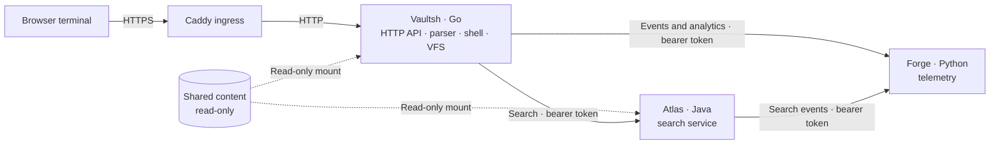

# vaultsh

A read-only virtual shell engine with a virtual filesystem, sessions, pipelines,
and pluggable commands.

## Features

- Read-only virtual filesystem backed by mounted raw Markdown files
- Familiar commands including `ls`, `cd`, `cat`, `tree`, and `grep`
- Multi-stage pipelines
- Session-specific working directories and command history
- Command and path autocomplete
- HTTP API and disposable browser terminal
- Optional Atlas search and Forge telemetry integrations
- Terminal dashboard with analytics, service health, uptime, and deployment status
- Sanitized deployment metadata published by CI
- Live Atlas and Forge availability indicators
- Docker packaging and GitHub Actions CI

## Architecture



Commands interact only with the virtual filesystem. Content is loaded from
`CONTENT_PATH`, which defaults to `/app/content`. Vaultsh exposes no commands
that create, modify, or delete files.

When Atlas or Forge URLs are configured, Vaultsh also requires
`ATLAS_AUTH_TOKEN` or `FORGE_AUTH_TOKEN` respectively. It sends these values as
bearer credentials to the private service APIs.

## Testing

| Layer | Coverage |
| --- | --- |
| Unit | Tokenizer, lexer, parser, commands, paths, history, and negotiation state |
| Integration | Pipelines, sessions, autocomplete, HTTP handlers, service clients, and telemetry dispatch |
| Service | Atlas search/authentication and Forge aggregation/API/dashboard tests |
| Container | Multi-stage images run service test suites before creating runtime images |
| Deployment | Compose health checks plus public HTTPS verification in GitHub Actions |

## Production Safety

Vaultsh limits public API request bodies to 16 KB and command input to 4,096
bytes. It applies per-client token-bucket limits to execution and completion,
caps active sessions, configures HTTP server timeouts, and returns defensive
browser headers.

Configuration:

- `SESSION_LIMIT`: active session cap; defaults to `5000`
- `TRUST_PROXY_HEADERS`: trust Caddy's `X-Forwarded-For`; enable only when
  Vaultsh cannot be reached except through a trusted reverse proxy
- `DEPLOYMENT_METADATA_PATH`: optional path to CI-published deployment JSON
- `SENTINEL_METADATA_PATH`: optional path to CI-published Sentinel assessment JSON

The sibling `lab` repository contains the Caddy HTTPS production stack.
Do not expose Vaultsh directly when `TRUST_PROXY_HEADERS=true`.

## Quickstart

Run Vaultsh with Atlas and their shared content through the sibling `lab`
repository:

```sh
cd ../lab
docker compose up --build
```

Open http://localhost:8080/vault/. Requests to `/` redirect there.

For local development, install Go 1.24 or newer:

```sh
CONTENT_PATH=../lab/content go run ./cmd/vaultsh
go test ./...
```

## Example Commands

```sh
help
tree
ls -la /
cat /cv/about.md
cat /cv/skills.md | grep "Languages"
history | tail -n 5
pwd
cd cv/experience
ls -l
cat reversinglabs.md
tree -L 2 /projects
ls -Ra /
cat -n /cv/skills.md
grep -in "backend" /cv/about.md
head -n 3 /cv/skills.md
tail -n 2 /cv/experience/a1.md
wc /cv/skills.md
sort -r /cv/interests.md
search kafka
metrics
dashboard
deployments
whoami
```

Commands can be combined into pipelines:

```sh
cat /cv/skills.md | grep -i "go" | sort
cat /cv/experience/reversinglabs.md | grep -n "backend" | head -n 5
tree -L 3 / | grep "projects"
```

Use `--verbose` at the end of a command line to return pipeline execution
metadata from the HTTP API:

```sh
cat /cv/skills.md | grep Go --verbose
```

The browser terminal supports `Tab` completion, `Up`/`Down` history, and
`Ctrl+L` to clear the screen.

## Content

Portfolio content is stored in the sibling `lab` repository and mounted
read-only at runtime.

Markdown files use terminal-friendly headings, short prose, and labeled bullets
that remain useful with `grep`, Atlas search, and later document export.

```markdown
## Details

- **Focus:** Backend services and distributed systems
- **Technology:** Go and Docker
```

## Project Structure

```text
cmd/vaultsh/          application entry point
internal/command/     shell commands
internal/filesystem/  read-only virtual filesystem
internal/httpapi/     HTTP transport
internal/parser/      tokenizer, lexer, and parser
internal/shell/       execution engine and sessions
internal/storage/     mounted-content loader
web/                  browser terminal
```

Shared content and local orchestration documentation live in the `lab`
repository.
